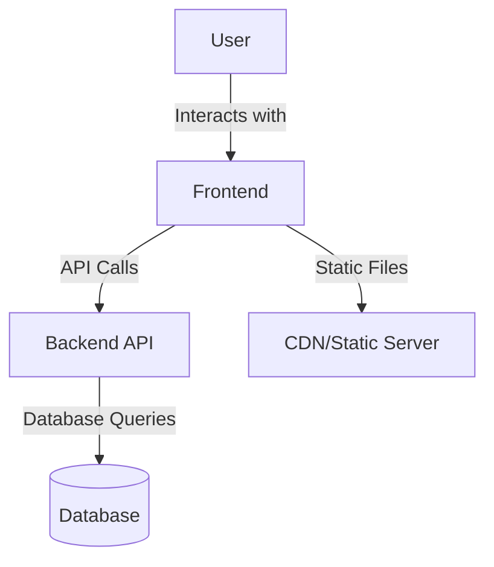

# Architecture & Technology

## Overview

The Blackjack Card Counter follows a modern web architecture with clear separation between frontend and backend. This page provides a detailed look at the technical implementation of the project.

## 🏗️ System Architecture



### Frontend (React)

- **Framework**: React 18
- **State Management**: React Context API + Redux
- **Styling**: Tailwind CSS
- **Build Tool**: Vite
- **Testing**: Jest + React Testing Library

### Backend (Python)

- **Framework**: FastAPI
- **Python Version**: 3.10+
- **Database**: SQLite (Development), PostgreSQL (Production)
- **Authentication**: JWT
- **API Documentation**: OpenAPI (Swagger)

## 📂 Project Structure

```
blackjack-card-counter/
├── frontend/               # Frontend code (React)
│   ├── public/             # Static files
│   ├── src/                # Source code
│   │   ├── components/     # Reusable components
│   │   ├── contexts/       # React Contexts
│   │   ├── hooks/          # Custom Hooks
│   │   ├── pages/          # Page components
│   │   ├── services/       # API Services
│   │   └── utils/          # Utility functions
│   └── ...
│
├── src/                    # Backend code (Python)
│   ├── api/                # API endpoints
│   ├── core/               # Core logic
│   │   ├── counting/       # Counting systems
│   │   ├── game/           # Game mechanics
│   │   └── models/         # Data models
│   ├── services/           # Business logic
│   └── utils/              # Utility functions
│
└── ...
```

## 🧩 Core Modules

### 1. Card Counting Systems

- **Counting System Interface**: Defines the common interface for all counting systems
- **Hi-Lo Implementation**: Classic Hi-Lo counting system
- **KO Implementation**: Knock-Out counting system
- **Omega II Implementation**: Advanced counting system

### 2. Game Mechanics

- **Game State Management**: Manages the current game state
- **Card Deck**: Manages cards and shuffling algorithms
- **Rules Engine**: Implements blackjack rules
- **Strategy Engine**: Calculates optimal moves

### 3. User Interface

- **Game Table**: Main game board component
- **Card Component**: Renders individual cards
- **Count Display**: Shows current count values
- **Settings**: User preferences and options

## 🔄 Data Flow

1. **Game Start**:
   - User starts a new game
   - Frontend sends request to backend
   - Backend initializes game and returns initial state
   - Frontend renders the game

2. **Card Draw**:
   - User draws a card
   - Frontend sends action to backend
   - Backend updates game state
   - Updated state is sent to frontend
   - UI updates accordingly

3. **Count Update**:
   - On each card change, the count updates
   - Counting system calculates new value
   - UI updates to reflect changes

## 🛠️ Technologies in Detail

### Frontend

- **React**: Component-based UI development
- **Redux**: Predictable state container
- **Tailwind CSS**: Utility-first CSS framework
- **Axios**: HTTP client for API communication
- **React Router**: Client-side routing

### Backend

- **FastAPI**: Modern, fast web API
- **SQLAlchemy**: ORM for database access
- **Pydantic**: Data validation
- **Alembic**: Database migrations

### Development Tools

- **Docker**: Containerization
- **Git**: Version control
- **GitHub Actions**: CI/CD pipelines
- **Prettier & ESLint**: Code formatting and quality

## 🔒 Security

- **HTTPS**: All connections are encrypted
- **JWT**: Secure authentication
- **Input Validation**: Protection against injection attacks
- **CORS**: Restricted cross-origin requests

## ⚡ Performance Optimizations

- **Lazy Loading**: Load components on demand
- **Memoization**: Avoid unnecessary recalculations
- **Database Indexing**: Faster queries
- **Caching**: Cache frequently accessed data

## 🧪 Testing Strategy

- **Unit Tests**: Test individual components and functions
- **Integration Tests**: Test component interactions
- **End-to-End Tests**: Test complete user flows
- **Performance Tests**: Ensure scalability

## 🚀 Deployment

The application can be deployed in several ways:

1. **Local Development**:
   ```bash
   # Frontend
   cd frontend
   npm install
   npm run dev

   # Backend
   cd ../src
   python -m uvicorn main:app --reload
   ```

2. **Docker**:
   ```bash
   docker-compose up --build
   ```

3. **Production**:
   - Frontend: Static files on CDN/Webserver
   - Backend: Containerized on Kubernetes/Serverless

## 🔮 Future Architecture

- **Microservices**: Split into smaller, independent services
- **WebSockets**: Real-time updates for multiplayer
- **Serverless**: Scalable backend architecture
- **Mobile Apps**: Native iOS and Android applications
