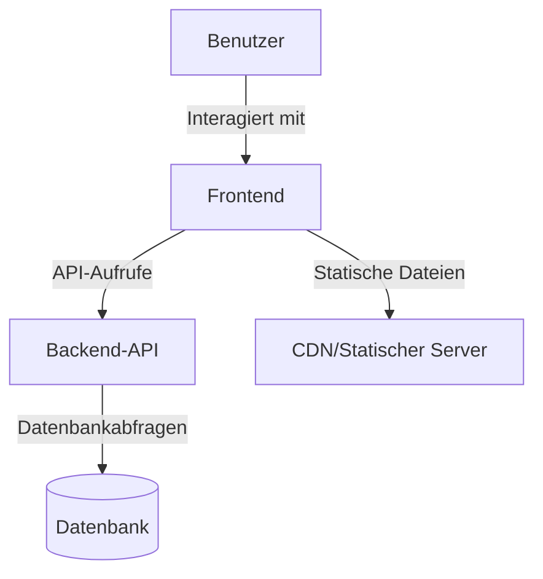

# Architektur & Technik

## Überblick

Der Blackjack Card Counter folgt einer modernen Webarchitektur mit klarer Trennung von Frontend und Backend. Diese Seite bietet einen detaillierten Überblick über die technische Implementierung des Projekts.

## 🏗️ Systemarchitektur



### Frontend (React)

- **Framework**: React 18
- **State Management**: React Context API + Redux
- **Styling**: Tailwind CSS
- **Build-Tool**: Vite
- **Test**: Jest + React Testing Library

### Backend (Python)

- **Framework**: FastAPI
- **Python-Version**: 3.10+
- **Datenbank**: SQLite (Entwicklung), PostgreSQL (Produktion)
- **Authentifizierung**: JWT
- **API-Dokumentation**: OpenAPI (Swagger)

## 📂 Projektstruktur

```
blackjack-card-counter/
├── frontend/               # Frontend-Code (React)
│   ├── public/             # Statische Dateien
│   ├── src/                # Quellcode
│   │   ├── components/     # Wiederverwendbare Komponenten
│   │   ├── contexts/       # React Contexts
│   │   ├── hooks/          # Custom Hooks
│   │   ├── pages/          # Seitenkomponenten
│   │   ├── services/       # API-Services
│   │   └── utils/          # Hilfsfunktionen
│   └── ...
│
├── src/                    # Backend-Code (Python)
│   ├── api/                # API-Endpunkte
│   ├── core/               # Kernlogik
│   │   ├── counting/       # Zählsysteme
│   │   ├── game/           # Spielmechanik
│   │   └── models/         # Datenmodelle
│   ├── services/           # Geschäftslogik
│   └── utils/              # Hilfsfunktionen
│
└── ...
```

## 🧩 Hauptmodule

### 1. Kartenzählsysteme

- **Zählsystem-Interface**: Definiert die gemeinsame Schnittstelle für alle Zählsysteme
- **Hi-Lo Implementierung**: Klassisches Hi-Lo Zählsystem
- **KO Implementierung**: Knock-Out Zählsystem
- **Omega II Implementierung**: Fortgeschrittenes Zählsystem

### 2. Spielmechanik

- **Spielzustandsverwaltung**: Verwaltet den aktuellen Spielzustand
- **Kartendeck**: Verwaltung der Karten und Mischalgorithmen
- **Regelwerk**: Implementierung der Blackjack-Regeln
- **Strategie-Engine**: Berechnet optimale Spielzüge

### 3. Benutzeroberfläche

- **Spieltisch**: Hauptkomponente für das Spiel
- **Kartenkomponente**: Darstellung einzelner Karten
- **Zählanzeige**: Zeigt aktuelle Zählwerte an
- **Einstellungen**: Benutzereinstellungen und Optionen

## 🔄 Datenfluss

1. **Spielstart**:
   - Benutzer startet ein neues Spiel
   - Frontend sendet Anfrage an Backend
   - Backend initialisiert das Spiel und sendet ersten Zustand zurück

2. **Kartenziehen**:
   - Benutzer zieht eine Karte
   - Frontend sendet Aktion an Backend
   - Backend aktualisiert den Spielzustand
   - Aktualisierter Zustand wird an Frontend gesendet
   - UI wird aktualisiert

3. **Zählung aktualisieren**:
   - Bei jeder Kartenänderung wird die Zählung aktualisiert
   - Zählsystem berechnet neuen Wert
   - UI wird entsprechend aktualisiert

## 🛠️ Technologien im Detail

### Frontend

- **React**: Komponentenbasierte UI-Entwicklung
- **Redux**: Vorhersehbarer State-Container
- **Tailwind CSS**: Utility-first CSS Framework
- **Axios**: HTTP-Client für API-Kommunikation
- **React Router**: Client-seitiges Routing

### Backend

- **FastAPI**: Moderne, schnelle Web-API
- **SQLAlchemy**: ORM für Datenbankzugriffe
- **Pydantic**: Datenvalidierung
- **Alembic**: Datenbankmigrationen

### Entwicklungswerkzeuge

- **Docker**: Containerisierung
- **Git**: Versionskontrolle
- **GitHub Actions**: CI/CD-Pipelines
- **Prettier & ESLint**: Code-Formatierung und -Qualität

## 🔒 Sicherheit

- **HTTPS**: Alle Verbindungen sind verschlüsselt
- **JWT**: Sichere Authentifizierung
- **Input-Validierung**: Schutz vor Injection-Angriffen
- **CORS**: Eingeschränkte Cross-Origin-Anfragen

## ⚡ Performance-Optimierungen

- **Lazy Loading**: Nachladen von Komponenten bei Bedarf
- **Memoization**: Vermeidung unnötiger Neuberechnungen
- **Datenbankindizes**: Schnellere Abfragen
- **Caching**: Häufig abgerufene Daten werden gecached

## 🧪 Teststrategie

- **Unit-Tests**: Testen einzelner Komponenten und Funktionen
- **Integrationstests**: Testen der Zusammenarbeit zwischen Komponenten
- **End-to-End-Tests**: Testen kompletter Benutzerabläufe
- **Performance-Tests**: Sicherstellen der Skalierbarkeit

## 🚀 Bereitstellung

Die Anwendung kann auf verschiedene Arten bereitgestellt werden:

1. **Lokale Entwicklung**:
   ```bash
   # Frontend
   cd frontend
   npm install
   npm run dev

   # Backend
   cd ../src
   python -m uvicorn main:app --reload
   ```

2. **Docker**:
   ```bash
   docker-compose up --build
   ```

3. **Produktion**:
   - Frontend: Statische Dateien auf CDN/Webserver
   - Backend: Containerisiert auf Kubernetes/Serverless

## 🔮 Zukünftige Erweiterungen

- **Microservices**: Aufteilung in kleinere, unabhängige Dienste
- **WebSockets**: Echtzeit-Updates für Mehrspieler-Modi
- **Serverless**: Skalierbare Backend-Architektur
- **Mobile Apps**: Native Apps für iOS und Android
